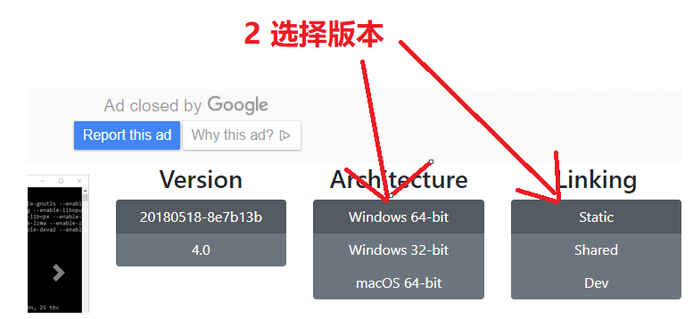
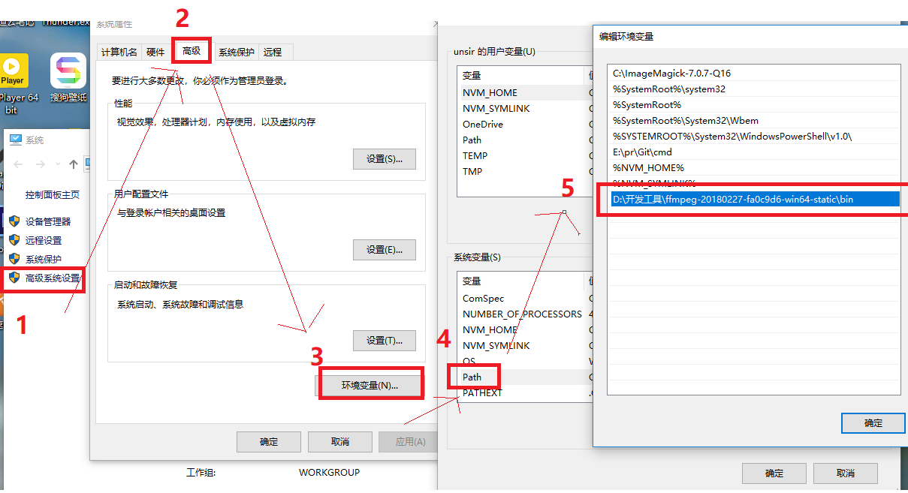
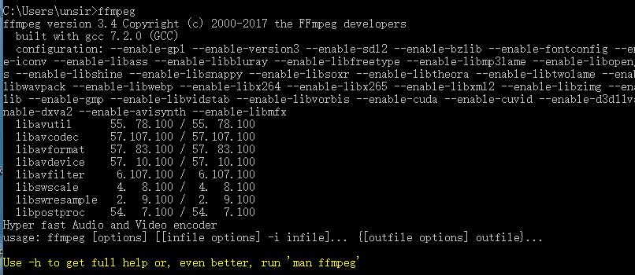
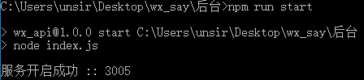
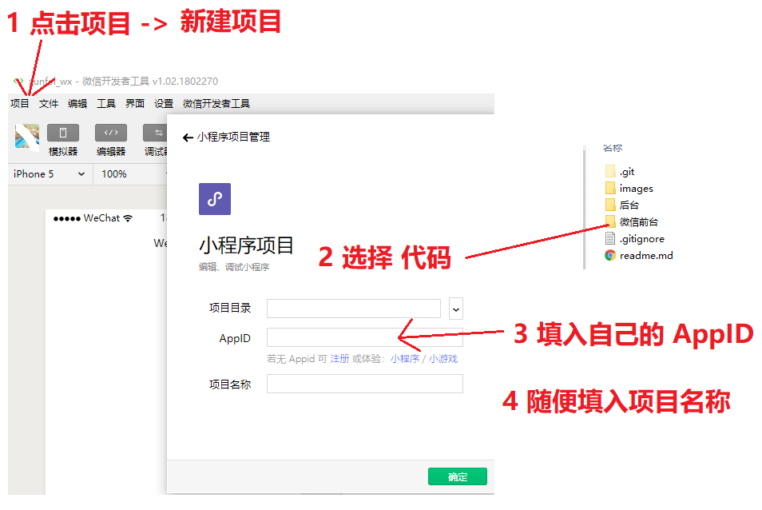
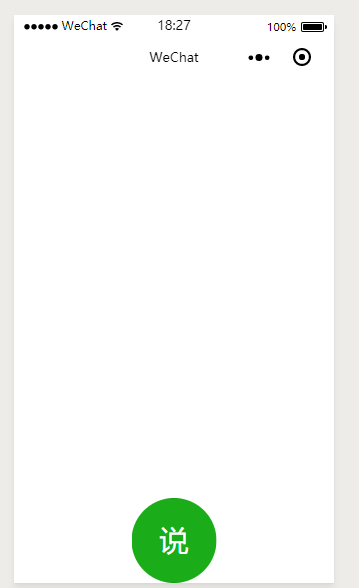
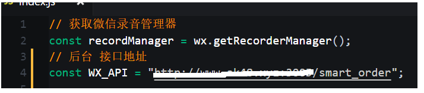
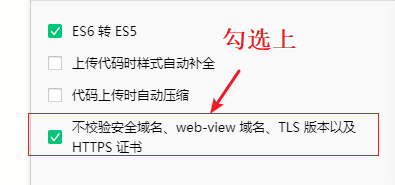
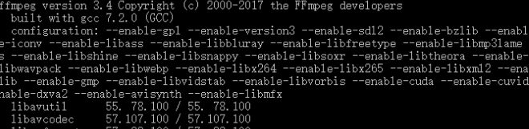
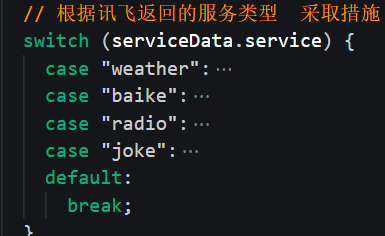

# 1. 介绍

​	本案例主要 实现一个微信小程序语音助手，可以以提供的功能如下：

| 语音输入     | 返回结果                             | 小程序            |
| ------------ | ------------------------------------ | ----------------- |
| 北京的天气   | 雨水将短暂停歇,最高*气温*回升至28℃。 | 语音播放 返回结果 |
| 讲个笑话     | 随机返回一个笑话                     | 语音念出该笑话    |
| 苹果百度百科 | 返回“苹果”的百度百科资料             | 语音念出该资料    |
| 我想听电台   | 返回实时电台列表信息                 | 自动播放电台      |

理论上  [讯飞技能商店](http://aiui.xfyun.cn/store/skill)中的所有功能 都可以实现。

# 2. 主界面

# 3. 主要技术

- [微信小程序](https://developers.weixin.qq.com/miniprogram/introduction/index.html?t=1526638122)
- [node](http://nodejs.cn/)
- 基于node的[express](http://www.expressjs.com.cn/) 框架
- [讯飞语音接口](https://console.xfyun.cn/app/myapp)
- 百度语音接口
- [FFmpeg](https://baike.baidu.com/item/ffmpeg/2665727?fr=aladdin)  用于转换语音格式

# 4. 环境要求

- 外网的服务器
- node 环境  本例为 `v8.9.0`
- 讯飞语音的账号
- 微信小程序开发者权限

# 5. 搭建环境步骤

## 5.1. 搭建FFmpeg

​	由于讯飞要求的录音格式和微信小程序的语音格式不兼容，所以需要将微信小程序的语音格式进行转换，使用的工具为 **FFmpeg ** 后期将在 **node** 中调用进行转换。 

​	需要注意的是，此操作需要在你的外网服务器上进行搭建。

### 5.1.1. 下载

在官方网站中进行下载即可  [下载地址](http://ffmpeg.org/download.html)

### 5.1.2. 配置环境变量

​	下载好后，解压 配置 系统的环境变量

### 5.1.3. 测试安装是否成功

​	配置好后，打开命令行工具 输入   `ffmpeg` 如出现下图结果，表示安装成功。

## 5.2. 搭建后台nodejs环境

​	后台代码需要配置在 外网服务器下，如 阿里云，腾讯云等

在后台代码根目录下 打开命令工具   输入：

1. `npm i` 安装依赖

2. 修改 讯飞 ID 和 密钥  （**如何获取？**  请查看 下面的  **开通讯飞语音接口功能章节** ）

   打开 `index.js`  修改

   

3. 输入 `npm run start` 启动项目 

4. ## 接口地址为  `http://ip:3005/smart_order`   

   

## 5.3. 配置微信小程序环境

### 5.3.1. 导入项目

​	使用 微信开发工具 导入 `微信前台代码` 

### 5.3.2. 成功导入

### 5.3.3. 修改接口地址

### 5.3.4. 注意

​	在测试环境下，记得 勾选上 **不校验域名xxxxxxx**

## 5.4. 小结

​	总结以上项目搭建的步骤

1. 搭建 FFmepg

   ​	打开命令行工具 输入   `ffmpeg`   出现以下结果代码成功

   ​	

2. 启动后台 node

   1. 修改 讯飞ID 和 讯飞密钥
   2. 在后台根目录下 输入 `npm run start` 启动。 默认端口号为 3005

3. 运行小程序代码

   1. 修改 后台接口地址 
   2. 手机运行小程序进行测试。

# 6. 开通讯飞语音接口功能

​	本次案例中，我们输入的是一段录音 如 **北京天气**  这段录音将会发送到讯飞接口，由它 来解析

- 将录音识别为 **北京天气**	 

- 再将 **北京天气** 识别为 **北京今天15度，微风xxx**

  此过程，nodejs后台已经处理好，只需要填入 自己的讯飞资料即可。下面将介绍如何开通讯飞语音，并且进行相关的设置。

## 6.1. 配置讯飞语音

1. 打开 [官网](http://www.xfyun.cn/) 进行注册
2. 注册成功后 登录，再打开 讯飞 [AIUI 开放平台](http://aiui.xfyun.cn/)
3. 进入 [我的应用](http://aiui.xfyun.cn/myApp/index)
4. 创建新应用 xxx
5. 为新创建的应用 添加技能 （电台，笑话，广播等）
6. 设置 [ip 白名单](http://aiui.xfyun.cn/myApp/whiteList/5aab789c)   新手建议直接关闭 即可。
7. 复制 该应用下的 AppID 和 ApiKey  复制到 nodejs 后台代码中即可。

## 6.2. 配置讯飞语音详细步骤

### 6.2.1. 注册

​	打开[注册页面](https://passport.xfyun.cn/register) 填入资料

### 6.2.2. 登录

​	直接登录，然后跳转到 讯飞  [AIUI 开放平台](http://aiui.xfyun.cn/)

### 6.2.3. 进入 我的应用

​	进入 [我的应用](http://aiui.xfyun.cn/myApp/index)

### 6.2.4. 创建新应用

​	因为我们这个案例 单独 创建一个应用， 名字自拟。

### 6.2.5. 为新应用添加技能

​	本案例中的 **天气、笑话、广播等** 都是该应用中的一个技能，因此，需要自己先添加。

​	点击进入 刚才新创建的应用  然后添加技能

小程序的处理代码，理论上，只要不断添加 **case** 代码 即可自己添加处理

### 6.2.6. 设置ip白名单

​	在讯飞中设置ip白名单，否则会出现 **ip非法** 的错误

### 6.2.7. 复制 AppID 和 ApiKey 到后台nodejs中

# 7. 使用步骤

​	当环境都搭建成功后，开始测试

​	

# 8. 帮助

​	因为本次案例，任何环节的操作失误都容易导致失败，并且在进行接口调试时，由于数据相对麻烦，因此在此给出一些建议。

### 8.1. 调试

​	进行调试时

- 后台  需要经常监控，容易出现一次错误，后台 直接 崩溃
- 小程序 多 **log** 打印结果进行调试

### 8.2. 讯飞语音接口

# 9. 联系方式

​	如出现问题，直接在该页面下留言即可。看到会回复。